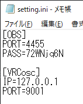

# HandRex:easy recorder system for VRC

VRChatのExpressionsMenuからOBSの録画ボタンをONにします。

VRC中に手元で録画できると便利だよねー。

https://youtu.be/OrPx39ktrf4

今のところ録画機能だけを実装しています。じきに機能を追加することがあるかもしれません。

問題報告、ご意見、改善案、新機能提案などがあればぜひ↓のフィードバックフォームまで！！！

https://docs.google.com/forms/d/e/1FAIpQLSeqNhhHpFh9A41OamSO6i-hh1BGTvr6kr5p8icIh5Dm74SUWg/viewform?usp=sf_link

あと大事な録画な時は、念のため、何かのデスクトップを見るツールでちゃんと動いているか見ておいてください。

## 概要

[obs-websocket](https://github.com/obsproject/obs-websocket)への通信を仲介するツールです。VRCのOSC出力を監視して、特定の変数(bool)がONになったらobsに録画するように送信します。

そのため、アバターに変数を仕込んであげる必要があります。もっと賢い導入方法をご存じの方が居れば教えてください。

## 導入

OBSは各自で設定してください。

### 1．OBS上のwebsocketの設定

OBS標準搭載のwebsocketを使用します。

「ツール」→「obs－websocketの設定」の順で押してください。

次に「obs－websocket設定」画面の「接続情報を表示」の画面を押してください。

この時にWebSocketサーバーを有効にするにチェック☑を入れてください。

するとポートとパスが表示されます。これらはあとで使うので覚えておいてください。メモしてもいいです。

#### 1.1．obs－websocketの導入(基本的に不要。古いOBSを使用している場合)

いつの間にかwebsocketはOBS標準搭載だったようです。古いOBS(バージョン27以前)を使用している場合以外はこの手順は必要ありません。

下のリンクからobs-websocketをDL&導入してください。

[obsproject/obs-websocket: Remote-control of OBS Studio through WebSocket (github.com)](https://github.com/obsproject/obs-websocket)

OBSを起動して、portとpassを設定してください。

#### 1.5．obs-cliを導入しています(基本的に不要。どうしてもpathを通したい場合)

コマンドラインでobsを操作する「obs-cli」を同梱しています(MITライセンスだったので再配布していいはず)。

[muesli/obs-cli: OBS-cli is a command-line remote control for OBS (github.com)](https://github.com/muesli/obs-cli)

執筆時では「obs-cli_0.5.0_Windows_x86_64.zip」をダウンロードしました。
↓のようにzip内の「obs-cli.exe」を配置しています。

この「obs-cli.exe」をどうしても、どうしても除去して、pathを通したい場合は「obs-cli.exe」をpathの通ってる場所に配置してあげればOKです。

今回、学習コストを抑えるためにobs-cliを使用しました。
余計なインストールなので、バージョンアップでじきにオミットします。

### 3．アバターにboolで「recording」を追加します。

おもむろにunityを起動してください。

VRCExpressionParametersを開いて「recording」を追加します。
画像のように、「Bool」に設定してください。

注）アバターをいっぱい切り替える人の場合、savedをしていると録画が誤爆することがあります。気になる人はあえて外しておいた方がいいかもしれません。この辺の修正は後日実装...されるかもしれませんね。

### 4．アバターにメニューを追加します。

VRCExpressionsMenuを開きましょう。

一番下の「Add Control」を押して、新しいメニューのNameを「Record」、Typeを「Toggle」、Parameterを先ほど設定した「recording」に設定します。

#### 4.5．アイコン設定

どうしてもと言うなら、アイコンを設定しても構いません。
その時は同梱のアイコンをunityにD&Dして、spriteに変更してから、

↓のようにアイコンを設定します。

これはしなくても動作自体には問題ありません。

３種類くらいアイコンを入れておきました。必要なら使ってみてください。

### 5．「HandRex:easy recorder system for VRC」の設定&起動

DLした「HandRex:easy recorder system for VRC」のzipを解凍します。そういえば解凍って今は通じないことあるんですって。ｺﾜｲﾖｰ

ともかく、この2ファイルがあるはずです。まずは「setting.ini」を開きましょう。

開いたら、先ほどメモした(...してるよね？)portとpassを貼り付けてください。↓みたいな感じです。

そしたら「obs_switcher_websocket.exe」を起動してください。別にVRC起動中でも起動前でもどちらでも大丈夫です。起動に特に依存関係はありません。

また、1.1を設定した場合は「obs_recorder.exe」を起動してください。

### 6．レッツ録画

手元のExpressionsMenuを開いたら「Record」があるはずです。

トグルするとOBSの録画が始まります(ちゃんと動くといいなぁ)。やったね！！！！

https://youtu.be/OrPx39ktrf4

## 動作環境

わからん...。動かなかったら問い合わせてください。

## ライセンス

GPL v2.0です。[obs-websocket](https://github.com/obsproject/obs-websocket)がGPL v2.0だからです。MITにしようと思いましたが、念のため継承しておきます。問題があればお問い合わせください。対応できるかはわかりません。

## 寄付は絶賛受付中

絶賛受付中🤑💴です！！！！！！！！！！！！！💴

寄付版を買ってもらうか、以下から投げ銭を受け付けています。

受け付けています！！！！！！！！！！！！！！！

## 問い合わせ先

DM頂戴ね→[Twitter](https://twitter.com/Kurogane_8_Gk)

すぐに答えられるかはわからないけれども。

## 開発者向け

以下は開発者向けです。よしなに。

pythonのコードをpyinstallerでexe化しただけのツールです。厳密には配布しているコードとexeで少しコードが異なりますが、挙動は同じです。コードはコメントを追加して整形しただけです。

### requierment

- [python-osc](https://pypi.org/project/python-osc/)

### 構造

VRChatのosc通信 → python-oscで受信 → subpprocessでobs-cliを動かす → obs-cliがobsのwebsocketに送信

の流れでobsを操作します。

...。

後なんか書いておいた方がいい事ってある？
